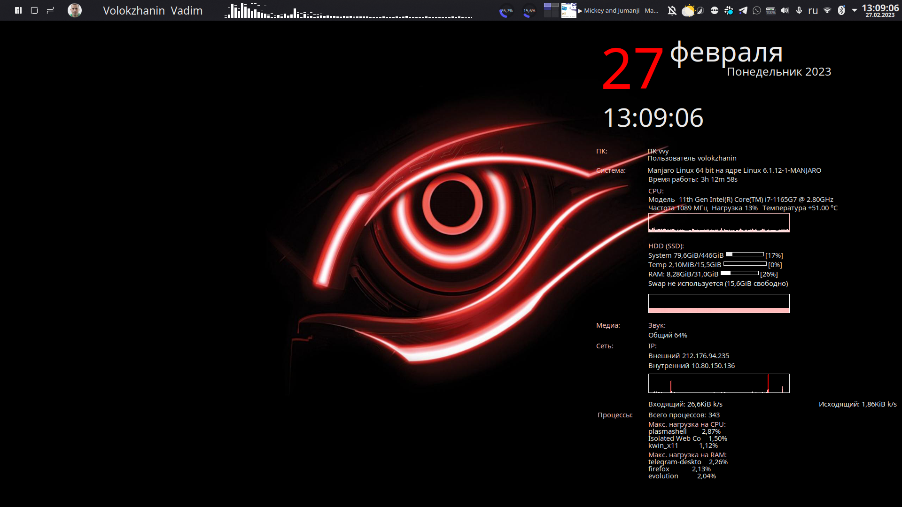

# System monitoring
* [conky](https://ru.wikipedia.org/wiki/Conky)




## Install Arch Linux
```
# Install conky
sudo pacman -S conky
```
## Autoload
```
# Create service
sudo touch ~/.config/autostart/conky.desktop
sudo nano ~/.config/autostart/conky.desktop

# Fill service file
[Desktop Entry]
Encoding=UTF-8
Version=0.9.4
Type=Application
Name=conky
Comment=System monitor
Exec=/mnt/0/documents/projects/pc_settings/conky/scripts/conky_scheduler.sh
StartupNotify=false
Terminal=false
Hidden=false
```
* [neofetch](https://losst.ru/neofetch-informatsiya-o-sisteme-linux-i-logotip-v-terminale)


```
# Install neofetch Arch Linux
sudo pacman -S neofetch
```
* [cpufetch](https://github.com/Dr-Noob/cpufetch)

```
# Install cpufetch Arch Linux
yay -S cpufetch-git  
```

* [htop](https://ru.wikipedia.org/wiki/Htop)


```
# Insatll htop Arch Linux
sudo pacman -S htop
```
